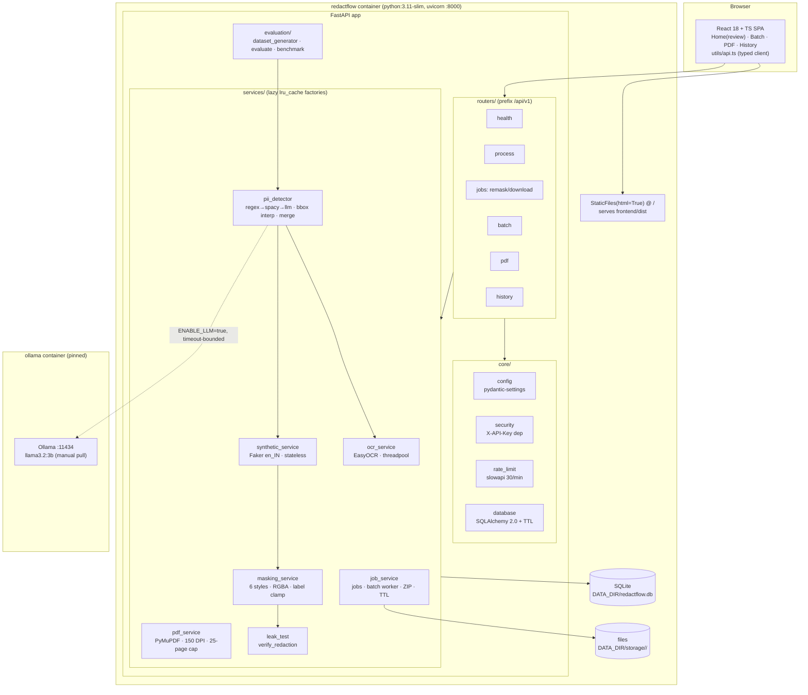
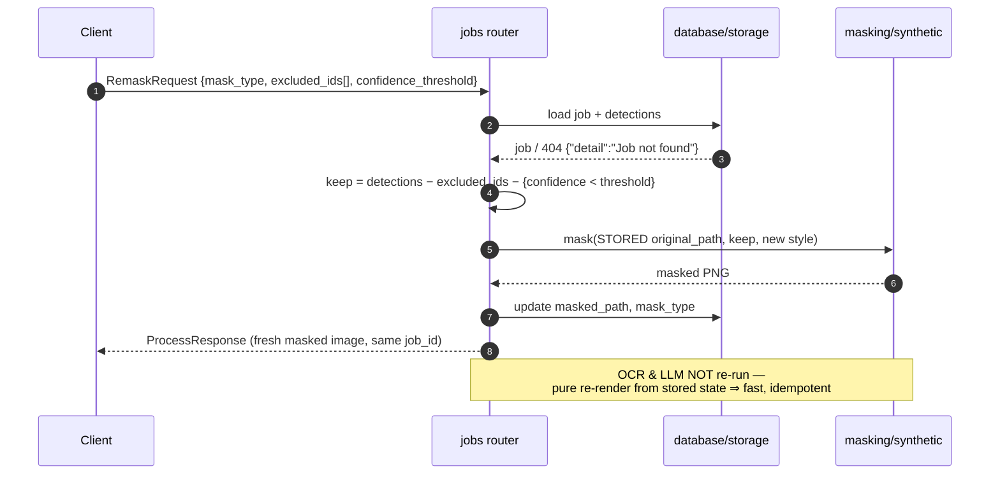
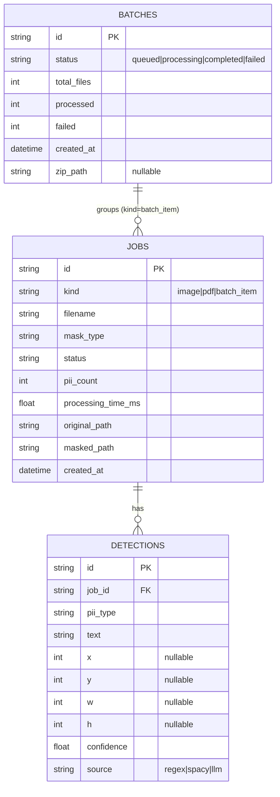

# RedactFlow v2 — Architecture & Design Decisions

This document explains *how the system is structured* and, more importantly,
*why* — including the alternatives that were rejected.

## 1. Component diagram



### Component responsibilities

| Component | Responsibility | Notable contract |
|-----------|----------------|------------------|
| `ocr_service` | Extract text regions (text + coarse pixel box) from images | EasyOCR reader created lazily on first use, always inside a threadpool; importing `main` never downloads models |
| `pii_detector` | 3-layer detection, span→pixel mapping, merge/dedup | Layers independently optional; unlocatable span ⇒ `bbox=None`, never fabricated; dedup key `(type, text.lower(), rounded bbox)` |
| `synthetic_service` | Format-preserving fake values + font-fit rendering | Pure/stateless — safe under concurrent batch items |
| `masking_service` | Six styles applied inside bboxes | Redbox = true alpha composite; labels y-clamped on-image |
| `pdf_service` | PDF → per-page 150 DPI images | >25 pages ⇒ HTTP 413 |
| `job_service` | Persistence, batch background worker, ZIP, TTL cleanup | Batch lifecycle is real DB state, not in-memory |
| `leak_test` | Re-OCR masked output, assert no PII string survives | Used by tests and as a CLI |
| `evaluation/*` | Ground-truth dataset, P/R/F1 ablation, latency benchmarks | Text-level (no OCR) so detector quality is isolated |

## 2. Sequence diagrams

### 2.1 `POST /api/v1/process` (single image)

```mermaid
sequenceDiagram
    autonumber
    participant C as Client
    participant R as process router
    participant V as validators
    participant O as ocr_service
    participant D as pii_detector
    participant S as synthetic/masking
    participant DB as database/storage
    C->>R: multipart(file, mask_type, confidence_threshold)
    R->>V: magic bytes (PNG/JPEG), size ≤ 10 MB
    V-->>R: ok / 4xx {"detail": ...}
    R->>O: regions = readtext(image) [run_in_threadpool]
    O-->>R: [{text, bbox}]
    R->>D: detect(full_text, regions)
    Note over D: L1 regex (+Verhoeff/Luhn/octet/date gates)<br/>L2 spaCy (if ENABLE_SPACY, else skip)<br/>L3 Ollama (if ENABLE_LLM, timeout-safe)
    Note over D: bbox = proportional interpolation<br/>merge on (type, text.lower(), rounded bbox)
    D-->>R: detections[] (bbox nullable)
    R->>S: mask(original, detections with bbox, style, threshold)
    S-->>R: masked PNG (base64)
    R->>DB: INSERT job + detections; write storage/<job_id>/
    R-->>C: ProcessResponse {job_id, detections, pii_count,<br/>masked/original b64, processing_time_ms}
```

### 2.2 `POST /api/v1/jobs/{job_id}/remask` (human-in-the-loop)



This endpoint is the architectural backbone of the review UI: unchecking a
checkbox is a filter on *stored* detections, so the loop latency is
milliseconds and the original is never re-OCRed into a different state.

### 2.3 Batch lifecycle

```mermaid
sequenceDiagram
    autonumber
    participant C as Client
    participant R as batch router
    participant W as BackgroundTasks worker
    participant DB as database/storage
    C->>R: multipart(files[] ≤20, mask_type)
    R->>DB: INSERT batches(status=queued) + job rows per file
    R-->>C: BatchResponse {batch_id, total_files, queued}
    Note over R,W: response returned BEFORE work starts
    R->>W: process_batch(batch_id, files)
    W->>DB: status=processing
    loop for each file
        W->>W: full image pipeline (threadpool)
        alt success
            W->>DB: item completed, processed++
        else failure
            W->>DB: item failed(error), failed++
        end
    end
    W->>DB: build ZIP → zip_path; status=completed
    loop poll every 2s
        C->>R: GET /batch/{id}
        R-->>C: BatchStatus {status, processed/total, items[]}
    end
    C->>R: GET /batch/{id}/download
    R-->>C: 200 application/zip (404 while not completed)
```

## 3. Database schema

See REPORT.md §4.2 for full column tables; the entity view:



## 4. Design decisions & tradeoffs

### 4.1 SQLite vs PostgreSQL

**Chosen: SQLite** at `DATA_DIR/redactflow.db` via SQLAlchemy 2.0.

- *For:* zero-admin deployment (crucial for a single-container deliverable);
  transactional integrity is more than sufficient for a single uvicorn
  process; the database file lives on the same volume as stored artifacts, so
  backup = one directory.
- *Against / accepted cost:* write concurrency is limited; multi-replica
  deployments would need Postgres.
- *Escape hatch:* all access goes through SQLAlchemy with a single
  `DATA_DIR`-derived URL, so switching to Postgres is a connection-string
  change, not a code change.

### 4.2 FastAPI BackgroundTasks vs Celery/RQ

**Chosen: `BackgroundTasks`** for the batch worker.

- *For:* no broker (Redis/RabbitMQ) to deploy or secure; batch state is
  durably tracked in the `batches` table (queued→processing→completed), so
  polling works without any extra infra; satisfies the ≤20-file, ≤10 MB-each
  workload comfortably.
- *Against / accepted cost:* the worker dies with the process (a batch
  interrupted by a restart stays `processing` — an acknowledged limitation);
  no distributed scaling.
- *Escape hatch:* the worker is a plain function over job rows; moving it to
  Celery later changes the trigger, not the logic.

### 4.3 Lazy model loading (no module-level singletons)

**Chosen:** services are built by `functools.lru_cache` factories and
injected with FastAPI `Depends`; the EasyOCR reader and spaCy pipeline load
on first *use*, inside a threadpool.

- *For:* importing `main` is instant and network-free — which is what makes
  the test suite hermetic (no network/GPU/Ollama needed, per SPEC 1.9) and
  keeps container start-up fast; a missing spaCy model degrades to regex-only
  with a warning instead of an import-time crash.
- *Cost:* first request pays model-load latency (mitigated by the container
  HEALTHCHECK `start_period`).

### 4.4 Monolith container (SPA + API in one image)

**Chosen:** multi-stage Dockerfile — `node:20-alpine` builds `frontend/dist`,
`python:3.11-slim` serves it via `StaticFiles(html=True)` at `/` with the API
under `/api/v1`.

- *For:* one image, one port, no CORS in production, trivial reverse-proxy
  story; the compose stack needs only the app + optional Ollama.
- *Against / rejected alternative:* separate Nginx/SPA container adds a
  moving part for zero benefit at this scale; Vite dev server remains the
  development path (CORS allow-list exists for it).
- *Cost:* any frontend change rebuilds the whole image — acceptable at this
  release cadence.

### 4.5 Proportional bbox interpolation vs word-level OCR boxes

**Chosen:** character-span → pixel mapping by linear interpolation within
OCR region boxes, with a hard "no fabricated box" invariant.

- *For:* detector-agnostic (regex/NER/LLM all emit character spans); simple,
  testable, exact for the common single-line case; spans that can't be
  located are reported with `bbox=None` rather than masked wrongly.
- *Cost:* approximation error on proportional fonts / long lines; a
  word-box OCR pipeline (future work) would be exact.

### 4.6 Optional LLM behind a strict failure contract

**Chosen:** Layer 3 default-off, timeout-bounded (`LLM_TIMEOUT`), any failure
logged and skipped, confidence clamped to [0.5, 0.95] and labelled
`source="llm"`.

- *For:* the core pipeline's reliability never depends on a local LLM being
  up; privacy stays default-local; honesty about uncalibrated confidence is
  encoded in the schema, not just the docs.
- *Cost:* three-way branching in the detector — managed by keeping each
  layer a small, independently testable function.

### 4.7 Synchronous def endpoints / run_in_threadpool for heavy work

**Chosen:** OCR, LLM calls, and PDF rendering run in `def` endpoints (or
explicit `run_in_threadpool`) so the event loop is never blocked.

- *For:* health checks and polling stay responsive during a heavy PDF job —
  which the batch UI depends on.
- *Cost:* threadpool sizing bounds throughput; acceptable for the single-node
  target.
