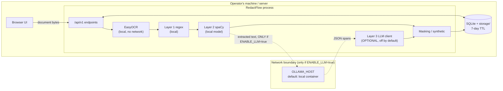

# RedactFlow v2 — Privacy & Threat Model

RedactFlow exists to *protect* personal data, so its own data handling must
be held to the same standard. This document describes what data the system
touches, where it goes, how long it lives, what can go wrong, and what is
done about it.

## 1. What data the system processes

| Data | Sensitivity | Where it lives |
|------|-------------|----------------|
| Uploaded originals (images/PDFs) | **High** — the whole point is they contain PII | `DATA_DIR/storage/<job_id>/` on local disk |
| OCR-extracted text | **High** | In memory during processing; PII spans persisted in the SQLite `detections` table |
| Masked outputs | Medium (redacted, but leak risk if masking failed) | `DATA_DIR/storage/<job_id>/` |
| Batch ZIPs | Medium | `DATA_DIR` (path in `batches.zip_path`) |
| Job metadata (filename, counts, timestamps) | Low | SQLite `jobs`/`batches` tables |

No analytics, telemetry, crash reporting, or external calls exist in the
default configuration. The only optional egress path is the LLM layer (§4).

## 2. Data-flow diagram

**Key property:** with `ENABLE_LLM=false` (the default), nothing crosses the
network boundary at all. Document bytes, extracted text, and detections stay
inside the process and its local data directory.

## 3. Threat model (STRIDE-style)

| # | Threat (STRIDE) | Asset at risk | Mitigations in code | Residual risk / operator duty |
|---|-----------------|---------------|---------------------|-------------------------------|
| T1 | **Spoofing** — unauthorised caller uses the API | Originals, detections | Optional `API_KEY` + `X-API-Key` header on all `/api/v1` routes except `/health`; 30 req/min per-IP rate limit on POSTs | If `API_KEY` is unset the API is open — acceptable only on localhost/trusted networks (documented in README). Set it when exposing the port. |
| T2 | **Tampering** — malicious upload (polyglot file, zip-bomb-ish PDF, path traversal via filename) | Process integrity, disk | Magic-byte validation (PNG/JPEG), 10 MB size cap, 25-page PDF cap (413), filename sanitised to `[A-Za-z0-9._-]` ≤100 chars before any disk/header use | PDF parsing relies on PyMuPDF's own hardening; keep dependencies pinned and updated. |
| T3 | **Repudiation** — "who redacted what, when" disputes | Audit trail | `jobs`/`batches` tables record kind, filename, mask type, counts, timestamps; history endpoint exposes the last 50 jobs | No per-user identity (single-operator design) and no immutable log. Future work: hashed audit log. |
| T4 | **Information disclosure** — leak of stored originals; PII in error messages; residual PII after masking | Originals, text, outputs | Errors return generic `{"detail": ...}` (never `str(e)`); 7-day TTL cleanup; immediate `DELETE /history/{id}`; leak-test harness verifies masking completeness; `bbox=None` detections are reported but never "masked" with a fabricated box | (a) Disk is unencrypted by default — use OS full-disk encryption for sensitive workloads. (b) OCR misses mean some PII may never be detected; redaction of *undetected* PII cannot be guaranteed — human review step exists for this reason. |
| T5 | **Denial of service** — oversized/expensive requests exhaust CPU | Availability | Size/page/file-count caps; per-IP rate limiting; heavy work in threadpool so the event loop stays responsive; LLM calls bounded by `LLM_TIMEOUT` | A single process has finite throughput; determined abuse requires a front proxy. |
| T6 | **Elevation of privilege** — container escape via crafted image | Host | Runtime deps pinned; no shell-outs to external binaries from request paths (pure-Python/native libs); container runs the app directly, minimal slim base image | Standard container hygiene applies: don't run as privileged, keep Docker updated. |

## 4. LLM disclosure (read before enabling)

- Layer 3 is **off by default** (`ENABLE_LLM=false`). In this mode detection
  is regex + spaCy only and **fully local**: no document content, extracted
  text, or metadata is transmitted anywhere.
- When `ENABLE_LLM=true`, the **full extracted text of each document** is sent
  in the prompt to `OLLAMA_HOST` (default `http://localhost:11434`, i.e. the
  companion container). The operator is responsible for what `OLLAMA_HOST`
  points at. Pointing it at a remote/hosted Ollama-compatible endpoint would
  send PII-bearing text to that third party — **do not do this** for
  sensitive documents.
- LLM confidence values are model-reported and **not calibrated**; they are
  clamped to [0.5, 0.95] and labelled `source="llm"` in the UI and API.
- LLM failure (timeout, malformed JSON, unreachable host) never crashes the
  pipeline: the layer is skipped and the result is identical to
  regex+spaCy mode.

## 5. Retention policy

| Artifact | Lifetime |
|----------|----------|
| Stored originals & masked outputs | **7 days**, then removed by `cleanup_old_jobs(days=7)` (runs on startup) |
| `jobs` / `detections` / `batches` rows | 7 days (same cleanup) |
| Batch ZIPs | 7 days (same cleanup) |
| Any single job | Immediately deletable via `DELETE /api/v1/history/{job_id}` |
| In-memory text | Lifetime of the request/background task only |

Seven days balances "download it later" convenience against data
minimisation. Operators handling regulated data can shorten the TTL by
calling `cleanup_old_jobs(days=N)` with a smaller `N` (the cleanup is a
plain callable in `core/database.py`).

## 6. DPIA-style considerations

A lightweight Data Protection Impact Assessment, in the spirit of GDPR
Art. 35 / DPDP Act principles:

1. **Necessity & proportionality.** Processing is limited to what redaction
   requires: OCR text, detected spans, pixel boxes. No profiling, no
   enrichment, no secondary use.
2. **Data minimisation.** Local-only default mode; 7-day TTL; on-demand
   deletion; synthetic replacement substitutes fake values so downstream
   copies of the *output* carry no real PII.
3. **Lawful basis / purpose limitation.** The tool is operated by (or on
   behalf of) the data controller on their own documents; purpose is
   redaction only. The system itself introduces no new purpose.
4. **Risk to data subjects.** Main risks: (a) *under-redaction* — OCR or
   detector misses leave PII visible (mitigated: human-in-the-loop review,
   leak-test harness, recall-emphasising evaluation); (b) *storage exposure*
   — originals on disk for up to 7 days (mitigated: local deployment,
   optional API key, TTL; operator: disk encryption, access control);
   (c) *false confidence* — uncalibrated LLM scores (mitigated: clamping,
   source labelling, documentation).
5. **Safeguards.** See §3 mitigations; evaluation chapter of docs/REPORT.md
   provides measured P/R/F1 so operators know the detection quality rather
   than assuming it.
6. **Data-subject rights.** Because deployment is single-operator and
   local, access/erasure requests are satisfied by the history endpoint and
   immediate delete; there is no hidden copy.
7. **Transfer.** None by default; §4 governs the only optional transfer and
   its conditions.

## 7. Operator checklist

- [ ] Run behind full-disk encryption for sensitive workloads.
- [ ] Set `API_KEY` if the port is reachable by anything other than localhost.
- [ ] Keep `OLLAMA_HOST` local when `ENABLE_LLM=true`; never point it at a
      hosted endpoint for sensitive documents.
- [ ] Always use the review step for high-stakes redaction; the detector's
      measured recall (docs/REPORT.md) is not 100%.
- [ ] Use opaque styles (blackbox/whitebox/synthetic) for archival redaction;
      blur/pixelate can be partially reversible for short strings.
- [ ] Keep the pinned dependencies and the pinned Ollama image updated.
