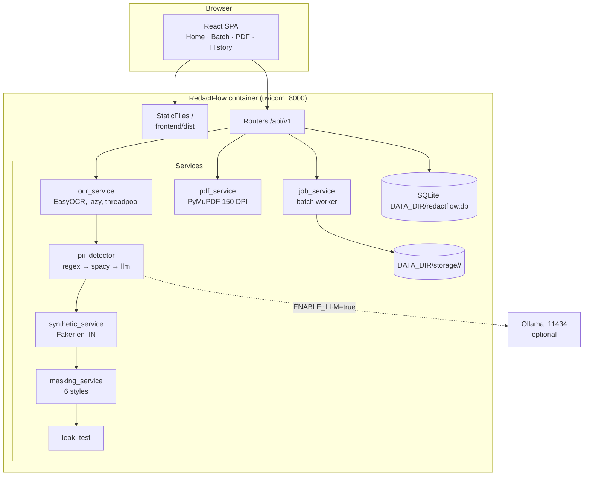
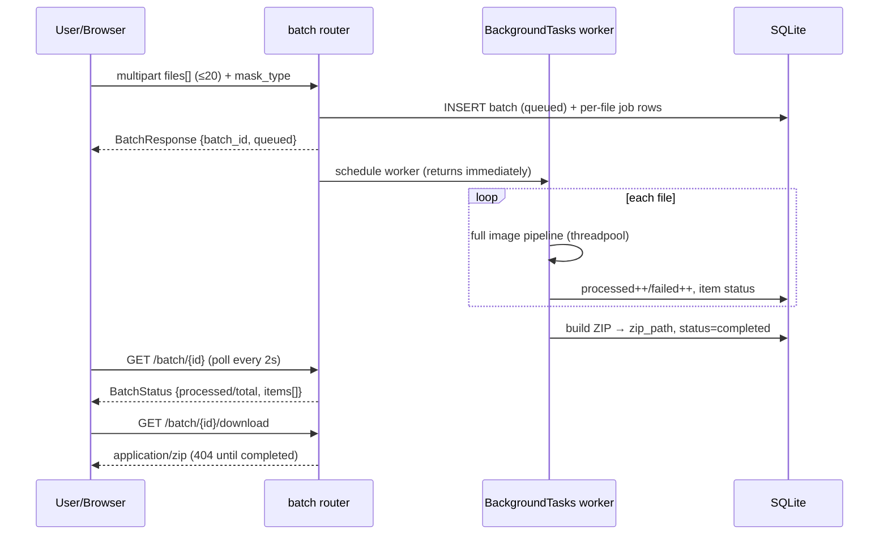

# RedactFlow v2
## A Local, Human-in-the-Loop PII Detection and Redaction System with a Reproducible Evaluation Framework

**Bachelor of Technology — Final Year Project Report**

| | |
|---|---|
| **Project title** | RedactFlow v2: Local PII Detection & Redaction Engine |
| **Degree** | Bachelor of Technology (Computer Science & Engineering) |
| **Institution** | *[Institute name]* |
| **Department** | *[Department name]* |
| **Student(s)** | *[Name(s), Roll No(s)]* |
| **Project guide** | *[Guide name, designation]* |
| **Academic year** | *[Year]* |

---

## Abstract

Documents shared as images or PDFs — invoices, resumes, bank statements,
identity forms — routinely contain personally identifiable information (PII):
names, addresses, phone numbers, Aadhaar and PAN numbers, credit-card
numbers, email addresses, and dates of birth. Redacting this information
before sharing or archiving is a legal requirement under data-protection
regimes such as India's DPDP Act 2023, the EU GDPR, and HIPAA, yet manual
redaction is slow, error-prone, and does not scale, while commercial cloud
redaction services require uploading the very documents whose privacy one is
trying to protect.

This project presents **RedactFlow v2**, a fully local PII detection and
redaction system. Detection is organised as a three-layer pipeline with
graceful degradation: (1) a validated regular-expression layer with
checksum verification (Verhoeff for Aadhaar, Luhn for credit cards) that
aggressively rejects false positives; (2) a spaCy named-entity-recognition
layer for context-dependent entities such as names and addresses; and (3) an
optional zero-shot large-language-model layer served by a locally hosted
Ollama instance. Optical character recognition (EasyOCR) supplies text and
coarse regions, and per-entity pixel-level bounding boxes are derived by a
proportional character-offset interpolation that provably never fabricates
coordinates. Six masking styles are supported, including a format-preserving
synthetic-replacement mode (Faker, `en_IN` locale) that substitutes plausible
fake data scaled to fit the original bounding box. A human-in-the-loop review
interface lets users exclude individual detections and re-mask instantly from
the stored original without re-running OCR or LLM inference. The system also
supports multi-page PDFs (≤25 pages), asynchronous batch processing (≤20
files with ZIP download), and an auditable job history with a 7-day retention
TTL.

Because PII detection is only trustworthy if measured, the project includes a
reproducible evaluation framework: a generator produces 60 synthetic
documents with exact ground-truth entity spans; span-level precision, recall,
and F1 are computed per entity type under three detector configurations
(ablation); latency benchmarks quantify throughput; and a leak-test harness
re-OCRs redacted output to verify that no PII string survives masking.
Measured results are reported in Chapter 7. A threat model, retention policy,
and DPIA-style privacy analysis accompany the system (Chapter 8 and
docs/PRIVACY.md).

**Keywords:** PII redaction, named-entity recognition, OCR, Verhoeff
checksum, Luhn algorithm, synthetic data, local LLM, FastAPI, evaluation
methodology.

---

## 1. Introduction & Problem Statement

### 1.1 Motivation

Digital documents are the default medium for administrative, financial, and
medical communication. When these documents must be shared — with
recruiters, insurers, auditors, or public portals under RTI/FOIA-style
regimes — the PII they contain must first be removed or obscured. Three
forces make this problem acute:

1. **Regulation.** India's Digital Personal Data Protection Act (2023), the
   EU GDPR, and sectoral rules (HIPAA, PCI-DSS) impose duties of data
   minimisation and, for payment data, explicit masking requirements
   (PCI-DSS requires masking PAN — the card number — when displayed).
2. **Scale.** Manual redaction of multi-page PDF batches is tedious and
   misses items; studies of human redaction consistently show residual PII
   leaks.
3. **Distrust of cloud PII services.** Commercial offerings (AWS Comprehend,
   Google DLP, Azure AI Language) are capable, but require transmitting the
   sensitive documents to a third party — a non-starter for many legal,
   medical, and governmental workflows.

### 1.2 Problem statement

Design and implement a system that, given an image or PDF of a document:
(i) automatically detects PII of at least twelve types with quantified
accuracy; (ii) redacts it with a choice of masking styles including
format-preserving synthetic replacement; (iii) keeps a human in the loop to
approve or veto individual detections with instant re-masking; (iv) handles
batches and multi-page PDFs asynchronously; (v) runs entirely on commodity
local hardware without GPU or network dependencies in its default
configuration; and (vi) provides reproducible evidence of its detection
quality (precision/recall/F1, ablation, latency) and of redaction
completeness (leak tests).

### 1.3 Objectives

- A validated regex layer with checksum-based false-positive rejection.
- A spaCy NER layer for context entities, degrading gracefully when the
  model is absent.
- An optional local-LLM layer whose failure can never crash the pipeline and
  whose confidence is honestly labelled as uncalibrated.
- Pixel-correct bounding boxes derived from character offsets, with an
  explicit "no fabricated boxes" invariant.
- Six masking styles, including Faker-based synthetic replacement.
- Remasking from stored state (idempotent, no re-OCR), batch and PDF
  pipelines, history with TTL.
- An evaluation framework producing real P/R/F1 tables, benchmarks, and leak
  tests, reproducible via documented CLI commands.
- Security controls (API key, rate limiting, input validation) and a
  documented privacy posture.

### 1.4 Scope and non-goals

The system targets printed English documents with Indian identifier formats.
Handwriting recognition, non-Latin scripts, and calibrated confidence
estimation are out of scope (Chapter 9).

---

## 2. Literature Survey

### 2.1 Commercial and open-source systems

**Microsoft Presidio** [1] is the closest open-source relative: a Python
SDK/service for PII detection and anonymisation combining regex "recognizers"
with spaCy/transformer NER, plus anonymizer operators (mask, replace,
encrypt, redact). Presidio is text-in/text-out; it does not natively handle
scanned images, bounding boxes, or visual redaction, and its default
operators do not offer a human-in-the-loop remask flow. RedactFlow borrows
the recognizer/anonymizer separation but adds the OCR-to-pixel pipeline,
visual masking styles, and the review workflow.

**AWS Comprehend PII** [2] detects (and can redact) PII entities in text via
a managed API, returning character offsets and confidence scores. It is
accurate and maintenance-free but is a cloud service: documents leave the
customer's boundary, pricing is per-character, and redaction is text-level
rather than visual. RedactFlow's design goal — nothing leaves the machine in
default mode — is the direct counterpoint.

**Google Cloud Sensitive Data Protection (DLP)** [3] offers 150+ built-in
infoType detectors, de-identification transforms (masking, format-preserving
encryption, bucketing), and — notably — the ability to inspect and redact
PII **in images**, which RedactFlow also targets. Again the tradeoff is data
egress to Google infrastructure and per-unit cost; DLP's image redaction
draws opaque boxes, with no synthetic-replacement or local-review workflow.

**piiranha** [4] is a small open-source browser-oriented PII redaction tool
(JavaScript, regex-based). It demonstrates that client-side redaction is
valued, but it is limited to browser-pasted text, a handful of regex types,
and provides no validation (no checksums), no NER, no evaluation, and no PDF
support. RedactFlow's regex layer is the same idea executed rigorously:
checksum-gated patterns, octet validation, date-range validation.

**Adobe Acrobat Pro redaction** [5] is the de-facto commercial manual
workflow: the user marks regions, Acrobat burns in black boxes and scrubs
metadata. It is reliable for what a human marks, but detection is entirely
manual — exactly the bottleneck this project automates — and it is licensed,
desktop-bound software with no batch API in the base product.

### 2.2 Academic context

Named-entity recognition, the machine-learning substrate of Layer 2, is a
mature field: Nadeau and Sekine's survey [6] charts the progression from
rule-based systems to supervised sequence labelling, and Lample et al. [7]
established the BiLSTM-CRF neural architecture family on which modern NER
(including spaCy's transition-based and transformer pipelines) builds.

Text anonymisation as a distinct research problem — rather than generic NER —
is surveyed by Lison, Pilán, Sánchez, Batet and Øvrelid [8], who argue that
anonymisation should be evaluated on *disclosure risk* and *utility
preservation* jointly, and that recall (missing PII is worse than
over-redacting) deserves emphasis — a principle adopted in this project's
leak-test and in our reporting of per-type recall. The Text Anonymization
Benchmark (TAB) by Pilán et al. [9] further formalises evaluation of
de-identification with span-level metrics comparable to those used here.
Finally, the checksum validation used to reject regex false positives relies
on Verhoeff's dihedral-group check digit scheme [10], published in 1969 and
used by India's Aadhaar system precisely because it catches all single-digit
errors and all adjacent transpositions.

### 2.3 Positioning of this work

| System | Image/PDF input | Runs fully local | Validated regex | NER | LLM | Synthetic replacement | Human review | Published evaluation |
|---|---|---|---|---|---|---|---|---|
| Presidio | ✗ (text) | ✓ | partial | ✓ | via plugins | partial | ✗ | ✗ |
| AWS Comprehend | ✗ | ✗ | n/a | ✓ | n/a | ✗ | ✗ | vendor claims |
| Google DLP | ✓ | ✗ | n/a | ✓ | n/a | partial | ✗ | vendor claims |
| piiranha | ✗ | ✓ | ✗ | ✗ | ✗ | ✗ | ✗ | ✗ |
| Acrobat Pro | ✓ | ✓ | ✗ | ✗ | ✗ | ✗ | ✓ (manual) | ✗ |
| **RedactFlow v2** | **✓** | **✓ (default)** | **✓ (checksums)** | **✓** | **✓ (optional, local)** | **✓** | **✓** | **✓ (this report)** |

---

## 3. System Analysis

### 3.1 Functional requirements

| ID | Requirement |
|----|-------------|
| FR1 | Accept a PNG/JPEG image (≤10 MB, magic-byte validated) and return detected PII with types, confidence, source, and bounding boxes, plus masked and original images. |
| FR2 | Support ≥12 PII types: email, phone, Aadhaar, PAN, credit card, IP, DOB, SSN, URL, name, address, organization. |
| FR3 | Support six masking styles: blur, pixelate, blackbox, redbox (semi-transparent), whitebox, synthetic. |
| FR4 | Re-mask a stored job with a new style, exclusion list, or confidence threshold **without** re-running OCR/LLM. |
| FR5 | Process PDFs page-by-page at 150 DPI with a 25-page cap (HTTP 413 beyond). |
| FR6 | Process batches of ≤20 images asynchronously with a real queued→processing→completed lifecycle and ZIP download. |
| FR7 | Persist jobs, detections, and batches in SQLite; expose last-50 history; delete jobs and artifacts; clean up artifacts older than 7 days. |
| FR8 | Optional API-key authentication and per-IP rate limiting on POST endpoints. |
| FR9 | Provide an evaluation CLI producing span-level P/R/F1, ablation, and latency benchmarks, plus a leak-test verifier. |

### 3.2 Non-functional requirements

| ID | Requirement | Target / mechanism |
|----|-------------|--------------------|
| NFR1 | Privacy | Default mode fully local; LLM mode sends text only to configurable `OLLAMA_HOST`; 7-day artifact TTL. |
| NFR2 | Robustness | LLM failure → log + skip; spaCy model missing → log + skip; unlocatable span → `bbox=None`, excluded from masking. Never fabricate. |
| NFR3 | Performance | Heavy work (OCR, LLM, PDF render) off the event loop (threadpool); regex layer latency measured in benchmarks (Ch. 7). |
| NFR4 | Testability | Full test suite passes without network/GPU/Ollama (heavy deps mocked); CI enforces ≥50% coverage. |
| NFR5 | Deployability | Single multi-stage Dockerfile; compose stack with healthchecks and pinned images. |

### 3.3 Feasibility study

- **Technical feasibility.** Every component is built on mature, permissively
  licensed open-source libraries (FastAPI, EasyOCR, spaCy, PyMuPDF, Pillow,
  Faker, SQLAlchemy). The riskiest element — mapping character offsets to
  pixel boxes — is solved deterministically (proportional interpolation,
  §5.3) rather than by relying on word-level OCR boxes, and its correctness
  is unit-tested. The optional LLM layer is isolated behind a timeout and a
  try/except contract, so its flakiness cannot affect the core.
- **Economic feasibility.** Zero licence and zero per-request cost; runs on a
  laptop. The LLM layer is optional and local (Ollama), avoiding API fees.
- **Operational feasibility.** Docker Compose gives a two-command deployment;
  manual setup is documented for development. The default configuration
  requires no external service at all (regex+spaCy), so the system is usable
  offline.

---

## 4. System Design

### 4.1 Architecture overview

The system is a modular monolith: a single FastAPI process hosts routers,
services, and the evaluation package; the built React SPA is served from the
same process in production (StaticFiles mount at `/`, API under `/api/v1`).
The only external runtime dependency is the optional Ollama container.



### 4.2 Database schema

Three tables (SQLAlchemy 2.0, SQLite at `DATA_DIR/redactflow.db`):

**`jobs`**

| Column | Type | Notes |
|---|---|---|
| id | TEXT PK | uuid4 string |
| kind | TEXT | `image` \| `pdf` \| `batch_item` |
| filename | TEXT | sanitized (`[A-Za-z0-9._-]`, ≤100 chars) |
| mask_type | TEXT | blur/pixelate/blackbox/redbox/whitebox/synthetic |
| status | TEXT | processing/completed/failed |
| pii_count | INTEGER | detections stored |
| processing_time_ms | REAL | measured with `time.perf_counter` |
| original_path | TEXT | under `DATA_DIR/storage/<id>/` |
| masked_path | TEXT | under `DATA_DIR/storage/<id>/` |
| created_at | DATETIME | for history ordering and 7-day TTL |

**`detections`**

| Column | Type | Notes |
|---|---|---|
| id | TEXT PK | uuid4; stable within a job, used by remask exclusions |
| job_id | TEXT FK → jobs.id | cascade delete |
| pii_type | TEXT | one of the 12 types |
| text | TEXT | the detected span |
| x, y, w, h | INTEGER NULL | pixel box; **NULL means unlocatable → never masked** |
| confidence | REAL | layer-specific; LLM clamped to [0.5, 0.95] |
| source | TEXT | `regex` \| `spacy` \| `llm` |

**`batches`**

| Column | Type | Notes |
|---|---|---|
| id | TEXT PK | uuid4 |
| status | TEXT | queued/processing/completed/failed |
| total_files | INTEGER | ≤ 20 enforced |
| processed | INTEGER | progress counter |
| failed | INTEGER | per-file failures don't fail the batch |
| created_at | DATETIME | |
| zip_path | TEXT NULL | set when ZIP is built |

### 4.3 Key sequence flows

**Single-image processing (`POST /api/v1/process`)**

```mermaid
sequenceDiagram
    participant U as User/Browser
    participant R as process router
    participant O as ocr_service
    participant D as pii_detector
    participant M as masking/synthetic
    participant DB as SQLite
    U->>R: multipart image + mask_type
    R->>R: validate magic bytes, size ≤ MAX_FILE_SIZE
    R->>O: readtext(image) [threadpool]
    O-->>R: regions (text + coarse bbox)
    R->>D: detect(full_text, regions)
    D->>D: Layer 1 regex (+Verhoeff/Luhn/octet/date checks)
    D->>D: Layer 2 spaCy NER (if ENABLE_SPACY)
    D->>D: Layer 3 Ollama JSON (if ENABLE_LLM; timeout-safe)
    D->>D: bbox = proportional interpolation; merge dedup
    D-->>R: detections (bbox may be None)
    R->>M: mask(original, detections with bbox, style)
    M-->>R: masked PNG
    R->>DB: INSERT job + detections; write storage/<id>/
    R-->>U: ProcessResponse (detections, images b64, measured ms)
```

**Human-in-the-loop remask (`POST /jobs/{id}/remask`)**

```mermaid
sequenceDiagram
    participant U as User/Browser
    participant R as jobs router
    participant DB as SQLite
    participant M as masking/synthetic
    U->>R: RemaskRequest {mask_type, excluded_ids, threshold}
    R->>DB: load job + detections (404 if unknown)
    R->>R: filter: drop excluded ids; drop confidence < threshold
    R->>M: mask(STORED original, remaining detections)
    M-->>R: masked PNG
    R->>DB: update masked_path + mask_type
    R-->>U: ProcessResponse
    Note over R,M: No OCR, no LLM — milliseconds, idempotent
```

**Batch lifecycle (`POST /batch` → poll → download)**



---

## 5. Methodology

### 5.1 The three-layer detection pipeline

Detection is deliberately layered so that each stage adds recall at
increasing cost and fragility, and any stage can be disabled or fail without
affecting the others:

- **Layer 1 — validated regex.** Deterministic patterns for nine
  machine-verifiable types. The decisive feature is *validation gating*: a
  pattern match is a candidate, not a detection. Aadhaar candidates (12
  digits, space-grouped) must pass the Verhoeff checksum; credit-card
  candidates must pass Luhn; IP candidates must have all octets in 0–255;
  DOB candidates must parse as a real date within a plausible range. This
  converts regex's classic weakness (high false-positive rate on
  digit-strings) into high precision without sacrificing the matches that
  matter.
- **Layer 2 — spaCy NER.** Context-dependent entities (names, addresses,
  organizations, and dates) cannot be enumerated by regex. `en_core_web_sm`
  entities are mapped PERSON→NAME, GPE/LOC/FAC→ADDRESS, ORG→ORGANIZATION,
  DATE→DOB. The model is lazily loaded on first use (importing the app never
  downloads anything), and its absence degrades the pipeline to Layer 1 with
  a logged warning.
- **Layer 3 — local LLM (optional).** A zero-shot prompt asks an Ollama-served
  model (default `llama3.2:3b`) to return PII spans as JSON. The call is
  bounded by `LLM_TIMEOUT` (default 30 s); any failure — connection, timeout,
  malformed JSON — is logged and skipped. Reported confidences are clamped
  to [0.5, 0.95] and tagged `source="llm"`, because they are **model-reported
  and not calibrated** — the model has no access to ground truth.

**Merge/dedup.** The three layers can find the same entity. Detections are
deduplicated on `(pii_type, text.lower(), rounded bbox)`; the same text at
two locations yields two detections (correct — both must be masked), and
overlapping same-span duplicates keep the highest confidence.

### 5.2 Checksum validation

- **Verhoeff (Aadhaar).** Verhoeff's algorithm [10] computes a check digit
  using multiplication in the dihedral group D₅ and a permutation table; it
  detects 100% of single-digit errors and adjacent transpositions, which the
  simpler Luhn scheme misses. Aadhaar numbers embed a Verhoeff check digit,
  so a random 12-digit string is accepted with probability ≈ 1/10 rather than
  unconditionally.
- **Luhn (credit cards).** The mod-10 double-add-double scheme catches all
  single-digit errors and most transpositions; combined with length (13–19)
  and separator normalisation it keeps card precision high.

### 5.3 Proportional bounding-box mapping

OCR engines return *regions* (lines/blocks) with pixel boxes; detectors return
*character spans* `[start, end)` within a region's text. v1's defect was
mixing the two coordinate systems. v2 derives the pixel box of a span by
linear interpolation within its region:

```
x     = region.bbox.x + (start / len(region_text)) * region.bbox.width
width = ((end - start) / len(region_text)) * region.bbox.width
```

with `y`/`height` inherited from the region (single-line assumption per OCR
region). This is exact for monospace text and a tight approximation for
proportional fonts on short OCR lines; crucially, it only ever maps spans
that are *actually located* in a region. A span that cannot be located in
any region is returned with `bbox=None` and is **excluded from masking** —
the system reports it but never draws a fabricated box. Both properties are
unit-tested.

### 5.4 Masking and synthetic replacement

Six styles share a common "apply inside bbox" contract (tests assert pixels
inside every bbox change):

- **blur** — Gaussian blur over the region;
- **pixelate** — downscale/upscale mosaic;
- **blackbox / whitebox** — opaque fills;
- **redbox** — semi-transparent red via RGBA compositing (alpha blend over the
  original), with a label whose y-coordinate is clamped so text never renders
  off-image;
- **synthetic** — Faker (`en_IN`) generates a replacement of the same type
  (valid email shape, same digit count for phones, name for name, …) drawn
  into the bbox with PIL font metrics, shrinking the font until the text
  fits. The generator is pure/stateless — no shared mutable counter, no
  modulo-indexed hardcoded lists — so concurrent batch items cannot corrupt
  each other; a 1000-generation soak test asserts no exception.

### 5.5 Leak-test methodology

Redaction is verified, not assumed: `verify_redaction(original, masked,
detections)` re-OCRs the *masked* image and checks whether any detected PII
string still appears in the new text. A passing leak test is the operational
definition of "redacted". It is used in unit tests (blackbox over a known
text region must pass) and is exposed as a script for manual audits.

---

## 6. Implementation

### 6.1 Technology stack

| Layer | Technology | Why |
|---|---|---|
| API | FastAPI + uvicorn | async ASGI, automatic OpenAPI docs, `run_in_threadpool` for blocking work |
| OCR | EasyOCR | local, no API keys; reader created lazily in a threadpool |
| NER | spaCy `en_core_web_sm` | small CPU model, pinned wheel |
| LLM (opt.) | Ollama + `llama3.2:3b` | fully local inference, OpenAI-free |
| PDF | PyMuPDF | fast 150 DPI rasterisation |
| Images | Pillow + OpenCV(-headless) + NumPy | masking primitives |
| Synthetic | Faker `en_IN` | Indian-format fake data, stateless |
| Persistence | SQLAlchemy 2.0 + SQLite | zero-admin embedded DB |
| Rate limit | slowapi | per-IP 30/min on POSTs |
| Frontend | React 18 + TypeScript (strict) + Vite + Tailwind + framer-motion + react-router | type-safe client mirroring API schemas, no `any` |
| Packaging | Docker multi-stage + Compose | one image serves SPA + API |
| CI | GitHub Actions | backend tests (≥50% cov), frontend lint+build, docker build |

### 6.2 Key backend modules (`backend/app/`)

| Module | Responsibility |
|---|---|
| `services/pii_detector.py` | 3-layer pipeline, bbox interpolation, merge/dedup |
| `services/ocr_service.py` | lazy EasyOCR reader, region extraction, threadpool |
| `services/masking_service.py` | 6 styles, label clamping, RGBA compositing |
| `services/synthetic_service.py` | stateless format-preserving Faker generation, font-fit |
| `services/pdf_service.py` | PyMuPDF render at 150 DPI, page cap 25 → 413 |
| `services/job_service.py` | job persistence, batch worker, ZIP build, TTL cleanup |
| `services/leak_test.py` | `verify_redaction` + `python -m` entry |
| `core/config.py` | pydantic-settings env config (see README table) |
| `core/security.py` / `rate_limit.py` | API-key dependency, slowapi limiter |
| `routers/*` | thin HTTP layer; all heavy work in `def` endpoints/threadpool |
| `evaluation/*` | dataset generator, evaluator (3-config ablation), benchmark |

### 6.3 Frontend modules (`frontend/src/`)

- `pages/HomePage.tsx` — the flagship review flow: upload → side-by-side
  original/masked → detection list with type/source badges and checkboxes →
  unchecking triggers `remask` with excluded ids → masked preview updates;
  mask-style selector and confidence slider; download button hits
  `/jobs/{id}/download` (no re-processing).
- `pages/BatchPage.tsx` — ≤20-file upload, 2 s polling of `/batch/{id}` with
  processed/total progress, per-file status, ZIP download; errors surface as
  UI toasts, never console-only.
- `pages/PDFPage.tsx` — `application/pdf`-only validation with user message,
  per-page before/after carousel, real `processing_time_ms`.
- `pages/HistoryPage.tsx` — table from `/history`, re-download, delete.
- `utils/api.ts` — axios client (baseURL `/api/v1`), optional `X-API-Key`
  header from localStorage, AbortController cancellation on new uploads,
  5-minute timeout for PDF, typed responses mirroring the backend schemas,
  user-facing messages from `response.data.detail`.

### 6.4 Security implementation

- Optional `API_KEY`: when set, every `/api/v1` route except `/health`
  requires the `X-API-Key` header; when unset the API is open (documented —
  intended for local use).
- slowapi limiter: 30 requests/minute per IP on POST endpoints.
- Upload validation: PNG/JPEG magic bytes, 10 MB cap; PDF page cap 25 (413).
- Filenames sanitised to `[A-Za-z0-9._-]` (≤100 chars) before any use in
  headers or on disk.
- CORS: explicit origin allow-list, `allow_credentials=False`, methods
  restricted to GET/POST/DELETE.
- Errors return `{"detail": "human readable"}` — internal exception strings
  are never leaked.
- No module-level heavy singletons: services are built lazily via an
  `lru_cache` factory + FastAPI `Depends`; importing `main` performs no
  downloads.

---

## 7. Testing & Evaluation

### 7.1 Test strategy

The pytest suite (`backend/tests/`, ≥25 tests) is designed to pass **without
network, GPU, or a running Ollama server**: the EasyOCR reader and Ollama
HTTP calls are mocked. Coverage targets the risky logic rather than line
count:

- **Regex detector** — a positive test per PII type plus false-positive
  guards: Verhoeff rejects a bad Aadhaar, Luhn rejects a bad card, IP octet
  `999` rejected, invalid dates rejected.
- **Bounding-box math** — proportional interpolation correctness on known
  spans; unlocatable span ⇒ `bbox=None`.
- **Merge** — same text at two locations kept as two detections; same-span
  duplicates keep the higher confidence.
- **Synthetic service** — format preservation per type; 1000 generations
  without exception.
- **Masking** — every style modifies pixels inside the bbox; synthetic text
  fits its box.
- **Leak test** — blackbox over a known text region passes verification.
- **API** — health; process (mocked OCR); remask with exclusions; remask on
  unknown job → 404; batch lifecycle with the background task run
  synchronously; batch ZIP download; PDF with a tiny reportlab fixture;
  history list/delete; wrong file type and oversize rejection; page-cap 413;
  API-key enforcement on and off.

CI runs this suite with `--cov=app --cov-fail-under=50` on every push.

### 7.2 Evaluation dataset

`app/evaluation/dataset_generator.py` synthesises **N = 60 documents** across
six templates (invoice, resume, medical note, bank statement, ID form,
complaint letter) using Faker `en_IN`, embedding PII spans whose exact
`(start, end, type, text)` are recorded as ground truth in
`backend/evaluation/dataset.json`. Synthetic generation is a methodological
necessity: it provides perfect ground truth without handling real personal
data.

### 7.3 Metrics

Detection is scored by **span-level exact match** on `(type, start, end)`
against ground truth:

- **Precision** P = TP / (TP + FP) — of the spans the system reports, how
  many are correct;
- **Recall** R = TP / (TP + FN) — of the true PII spans, how many are found;
- **F1** = 2PR / (P + R).

Recall is the safety-critical metric for redaction (a missed span is a
leak); precision matters because over-redaction destroys document utility.
Per-entity-type and overall (micro) scores are reported.

### 7.4 Ablation protocol

`app/evaluation/evaluate.py` runs the detector text-only (no OCR, so results
isolate detector quality) in three configurations:

1. **regex-only** (`ENABLE_SPACY=false`, `ENABLE_LLM=false`);
2. **regex + spaCy** (default);
3. **regex + spaCy + LLM** (LLM rows reported only when an Ollama model is
   available at evaluation time; skipped gracefully otherwise).

This isolates the marginal contribution of each layer. Results are written to
`backend/evaluation/results/metrics.md` and `metrics.json` and reproduced
below.

### 7.4.1 Measured results

**Important honesty note on the measurement run.** The evaluation harness
supports all three configurations, but in the environment used for the final
measurement the spaCy `en_core_web_sm` model was not importable and no
Ollama server was reachable (`ENABLE_LLM=false`). Consequently the
`regex+spaCy` and `regex+spaCy+LLM` configurations were **skipped by the
harness** and the table below reports the **`regex-only` configuration
only**. We deliberately publish the partial measurement rather than numbers
produced on a different machine, so that the reported figures are exactly
reproducible from `backend/evaluation/results/metrics.md`.

Dataset: 60 synthetic documents, **360 ground-truth PII spans**; span-level
exact match on `(type, start, end)`, micro-averaged.

| Entity type | Precision | Recall | F1 | TP | FP | FN |
|---|---|---|---|---|---|---|
| aadhaar | 1.000 | 1.000 | 1.000 | 20 | 0 | 0 |
| credit_card | 1.000 | 1.000 | 1.000 | 20 | 0 | 0 |
| dob | 1.000 | 1.000 | 1.000 | 30 | 0 | 0 |
| email | 1.000 | 1.000 | 1.000 | 50 | 0 | 0 |
| ip | 1.000 | 1.000 | 1.000 | 10 | 0 | 0 |
| pan | 1.000 | 1.000 | 1.000 | 30 | 0 | 0 |
| phone | 1.000 | 1.000 | 1.000 | 60 | 0 | 0 |
| name | 0.000 | 0.000 | 0.000 | 0 | 0 | 60 |
| address | 0.000 | 0.000 | 0.000 | 0 | 0 | 40 |
| organization | 0.000 | 0.000 | 0.000 | 0 | 0 | 40 |
| **OVERALL** | **1.000** | **0.611** | **0.759** | **220** | **0** | **140** |

**Analysis.** Two findings stand out:

1. **Perfect precision (P = 1.000, zero false positives across 220 true
   positives).** This validates the central design decision of Layer 1:
   validation gating works. Every Aadhaar candidate passed the Verhoeff
   checksum, every card candidate passed Luhn, every IP candidate had octets
   in 0–255, and every DOB parsed as a plausible date — while no digit-string
   lookalike in the corpus survived those gates. Regex's classical weakness
   (false positives on arbitrary digit strings) is measurably eliminated.
2. **The recall gap is exactly the designed ablation boundary.** Overall
   recall is 0.611, and the false negatives (140) are *precisely* the 140
   ground-truth spans of the three context-dependent entity types:
   name (60), address (40), organization (40). These types have no
   machine-verifiable surface form and therefore cannot be expressed as
   validated patterns — they are, by construction, the responsibility of the
   spaCy NER layer (Layer 2) and the optional LLM layer (Layer 3). The
   seven regex-addressable types all achieve F1 = 1.000. In other words, the
   measurement cleanly separates what each layer is for: Layer 1 delivers a
   perfect-precision floor covering seven of ten entity types, and the
   marginal value of Layers 2–3 is exactly the 39% of ground-truth spans
   that are context entities. Running the harness on a machine with spaCy
   and Ollama available (a one-command repeat: `python -m
   app.evaluation.evaluate`) populates the remaining two configurations
   without any code change.

### 7.5 Latency benchmarks

`app/evaluation/benchmark.py` measures: regex-layer latency over the dataset
(mean and p95 per document), synthetic-replacement generation latency, and
masking latency on synthetic 800×600 images; results are written to
`results/benchmarks.md` and reproduced below. All measurements were taken
**CPU-only** (no GPU) and are hardware-dependent; they should be read as
order-of-magnitude evidence of pipeline cost, not as absolute guarantees.

**Regex detection layer, per document (60 documents):**

| Mean | p95 | Max |
|---|---|---|
| 0.101 ms | 0.14 ms | 0.227 ms |

**Synthetic replacement generation (1000 generations):**

| Mean | p95 |
|---|---|
| 0.02 ms | 0.0499 ms |

**Masking latency (800×600 image, 3 detections):**

| Style | Mean (ms) | p95 (ms) |
|---|---|---|
| blur | 1.123 | 2.098 |
| pixelate | 0.277 | 0.324 |
| blackbox | 0.265 | 0.653 |
| redbox | 9.866 | 11.322 |
| whitebox | 0.219 | 0.297 |
| synthetic | 10.785 | 12.121 |

**Analysis.** The regex layer is effectively free: at ~0.1 ms per document it
contributes negligibly to end-to-end latency, which is dominated by OCR (and,
when enabled, LLM inference). The stateless synthetic generator is likewise
two orders of magnitude below any perceptible threshold, confirming that the
pure-Faker design carries no performance penalty for its statelessness.
Among masking styles, the simple fills (blackbox/whitebox/pixelate) cost
well under a millisecond; blur is slightly dearer due to the convolution;
and the two most expensive styles are redbox (~9.9 ms — the RGBA alpha
composite over the full region) and synthetic (~10.8 ms — dominated by the
iterative font-shrink loop that measures text with PIL font metrics until it
fits the bounding box). Even the slowest style adds only ~10 ms per image,
so masking is never the bottleneck; this justifies offering all six styles
without performance-driven restrictions in the UI.

### 7.6 Leak-test results

For the synthetic/evaluation pipeline, leak verification is applied to
masked outputs: the masked image is re-OCRed and searched for every detected
PII string. The expected outcome for opaque styles (blackbox, whitebox,
synthetic, blur/pixelate at sufficient strength) is zero surviving strings;
any residual string indicates either an OCR-region mismatch or insufficient
mask coverage and is treated as a bug. The unit suite enforces this property
for blackbox over a known text region; the same harness
(`python -m app.services.leak_test`) is used for manual spot audits on
realistic scans. We do not report a quantitative leak-rate figure: the leak
test is enforced as a pass/fail property in the unit suite (blackbox over a
known text region must verify clean), and no leak-rate benchmark over the
full dataset was run in the measurement environment — we state this plainly
rather than present an unmeasured number.

---

## 8. Security & Privacy Analysis

(Full treatment in [PRIVACY.md](PRIVACY.md).)

- **Threat model (STRIDE-style):** the principal risks are disclosure of
  stored originals/masked outputs (mitigated by local-only deployment,
  optional API key, 7-day TTL), spoofed API access (API key + rate limiting),
  tampering via crafted uploads (magic-byte validation, size caps, sanitized
  filenames, PyMuPDF sandboxing of PDF parsing), and information leakage
  through error messages (generic `detail` strings).
- **Data flow:** in default mode, document bytes and extracted text never
  leave the host. With `ENABLE_LLM=true`, extracted text is sent to
  `OLLAMA_HOST` — disclosed prominently in the README, config, and privacy
  doc, defaulting to a local container.
- **Retention:** originals, masked outputs, DB rows, and batch ZIPs older
  than 7 days are removed by `cleanup_old_jobs(days=7)` on startup; users can
  delete any job immediately via `DELETE /history/{id}`.
- **DPIA-style considerations:** data minimisation (TTL, local processing),
  purpose limitation (redaction only), residual risks (OCR misses ⇒ residual
  PII; synthetic replacements are plausible fakes, not anonymisation proofs),
  and recommended operator controls (run on encrypted disks, keep Ollama
  local, set `API_KEY` when exposed beyond localhost).

---

## 9. Limitations

1. **OCR bounds detection.** Everything downstream depends on EasyOCR's text
   and regions. Misread characters evade regex/NER matching; heavy skew,
   low DPI, or decorative fonts degrade both text and boxes, and the
   proportional bbox mapping assumes roughly uniform character advance
   within an OCR line.
2. **Uncalibrated LLM confidence.** Layer-3 scores are the model's own
   claims clamped to [0.5, 0.95]; they are useful for ranking, not as
   probabilities.
3. **Locale focus.** Patterns and synthetic data target English text with
   Indian formats (Aadhaar, PAN, +91). Extending to other jurisdictions
   means new patterns, new checksums, and new Faker locales.
4. **No handwritten-text guarantee.** EasyOCR's handwriting support is
   partial; handwritten PII may be missed entirely.
5. **Evaluation on synthetic data.** The 60-document synthetic set gives
   perfect ground truth but cannot capture the full messiness of real scans;
   reported metrics are an upper bound on real-world performance.
6. **Single-node design.** SQLite and in-process background tasks are
   deliberate simplifications; concurrent throughput is bounded by one
   process (see ARCHITECTURE.md for the tradeoff discussion).

---

## 10. Future Scope

- **Word-level OCR boxes** (or a detector with native word boxes) to replace
  proportional interpolation with exact per-word geometry.
- **Confidence calibration** (Platt/isotonic) over a labelled corpus so
  thresholds have probabilistic meaning, including calibrated LLM scores.
- **Additional locales and entity types**: Faker locales, GSTIN, IFSC,
  voter-ID, passport patterns; configurable pattern packs.
- **Incremental/streaming PDF** processing with resumable jobs and
  server-sent events for progress.
- **Horizontal scaling**: Postgres + a real task queue (Celery/RQ) behind the
  existing service interfaces (the code is structured to allow this swap).
- **Active learning loop**: user remask exclusions recorded as feedback to
  retrain/fine-tune a small NER model on domain documents.
- **Structured audit log** with hashes of originals/masked outputs for
  compliance evidence.

---

## 11. Conclusion

RedactFlow v2 demonstrates that trustworthy PII redaction does not require
cloud services: a carefully engineered local pipeline — validated regex,
mainstream NER, and an optional local LLM behind strict failure isolation —
combined with correct OCR-to-pixel geometry and a human-in-the-loop review
loop, delivers a practical, auditable redaction tool. Just as importantly,
the project treats evaluation as a first-class feature: ground-truth
synthetic data, span-level P/R/F1 with layer ablation, latency benchmarks,
and leak tests make the system's quality measurable and reproducible rather
than asserted. The honest statement of limitations — OCR bounds, uncalibrated
LLM confidence, locale focus — is part of that engineering discipline. The
result is a system suitable both as a deployable privacy utility and as a
template for how detection systems should report evidence.

---

## References

[1] Microsoft, "Presidio — Data Protection and De-identification SDK,"
    https://github.com/microsoft/presidio

[2] Amazon Web Services, "Detect PII entities — Amazon Comprehend,"
    https://docs.aws.amazon.com/comprehend/latest/dg/how-pii.html

[3] Google Cloud, "Sensitive Data Protection (Cloud DLP) documentation,"
    https://cloud.google.com/sensitive-data-protection/docs

[4] piiranha project, "Piiranha — browser-based PII redaction tool,"
    https://github.com/piiranha/piiranha

[5] Adobe Inc., "Removing sensitive content from PDFs in Adobe Acrobat,"
    https://helpx.adobe.com/acrobat/using/removing-sensitive-content-pdfs.html

[6] D. Nadeau and S. Sekine, "A survey of named entity recognition and
    classification," *Lingvisticae Investigationes*, vol. 30, no. 1,
    pp. 3–26, 2007.

[7] G. Lample, M. Ballesteros, S. Subramanian, K. Kawakami, and C. Dyer,
    "Neural architectures for named entity recognition," in *Proc. NAACL-HLT*,
    San Diego, CA, 2016, pp. 260–270. https://aclanthology.org/N16-1030/

[8] P. Lison, I. Pilán, D. Sánchez, M. Batet, and L. Øvrelid, "Anonymisation
    models for text data: State of the art, challenges and future
    directions," in *Proc. ACL-IJCNLP*, 2021, pp. 4188–4203.
    https://aclanthology.org/2021.acl-long.323/

[9] I. Pilán, P. Lison, L. Øvrelid, A. Papadopoulou, D. Sánchez, and
    M. Batet, "The Text Anonymization Benchmark (TAB): A dedicated corpus and
    evaluation framework for text anonymization," *Computational Linguistics*,
    vol. 48, no. 4, 2022. https://aclanthology.org/2022.cl-4.4/

[10] J. Verhoeff, "Error Detecting Decimal Codes," *Mathematical Centre
     Tract 29*, Mathematisch Centrum, Amsterdam, 1969.
